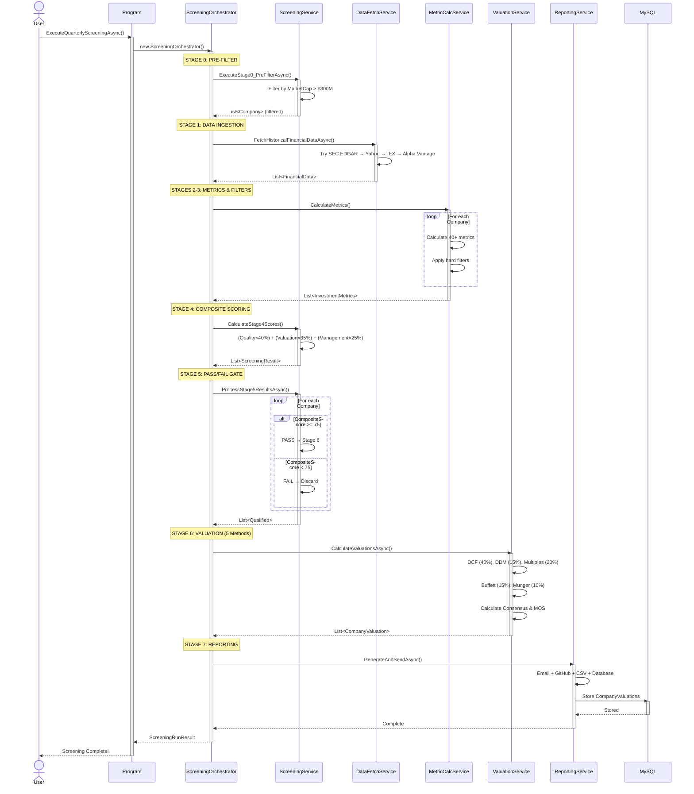
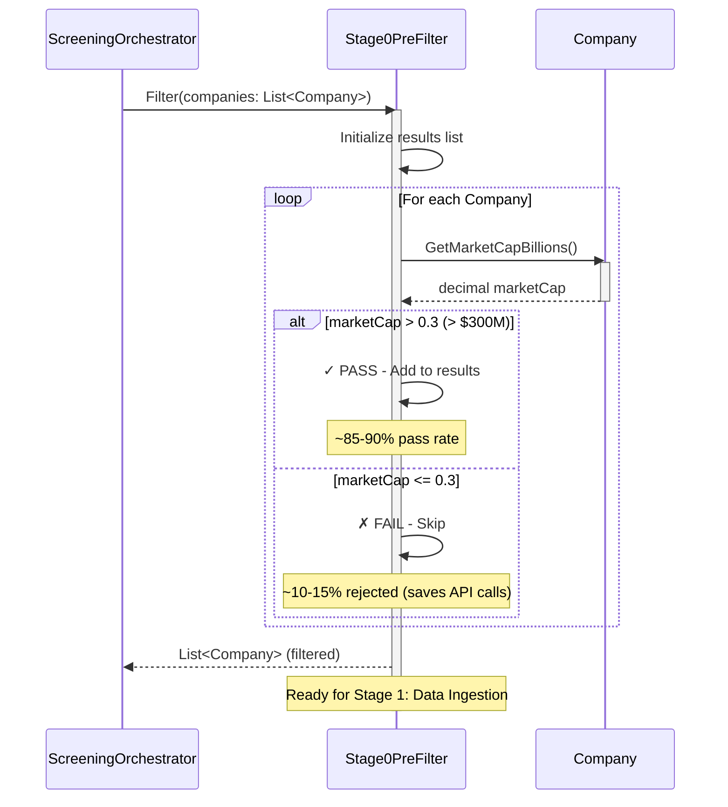
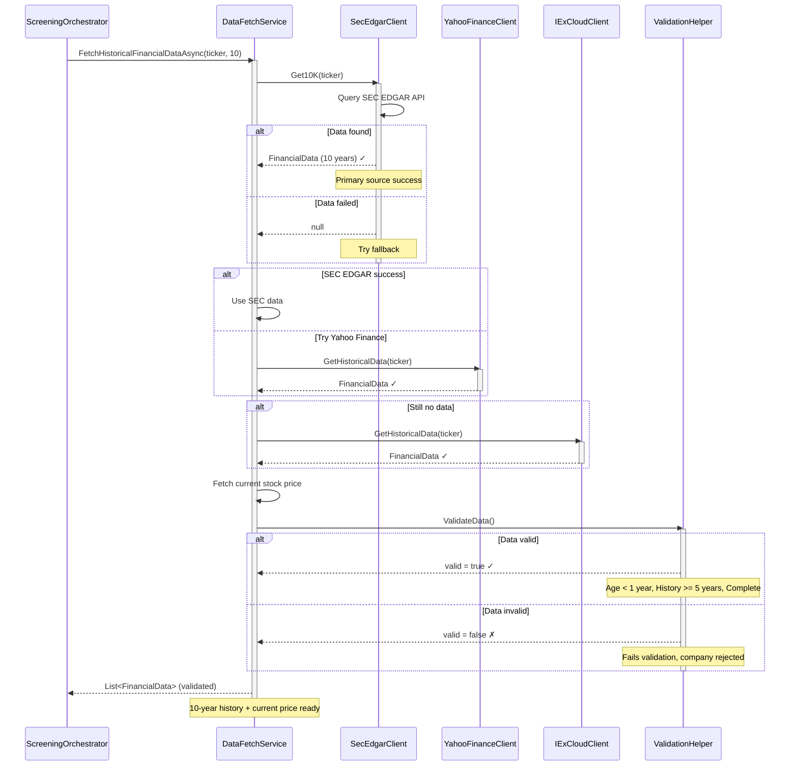
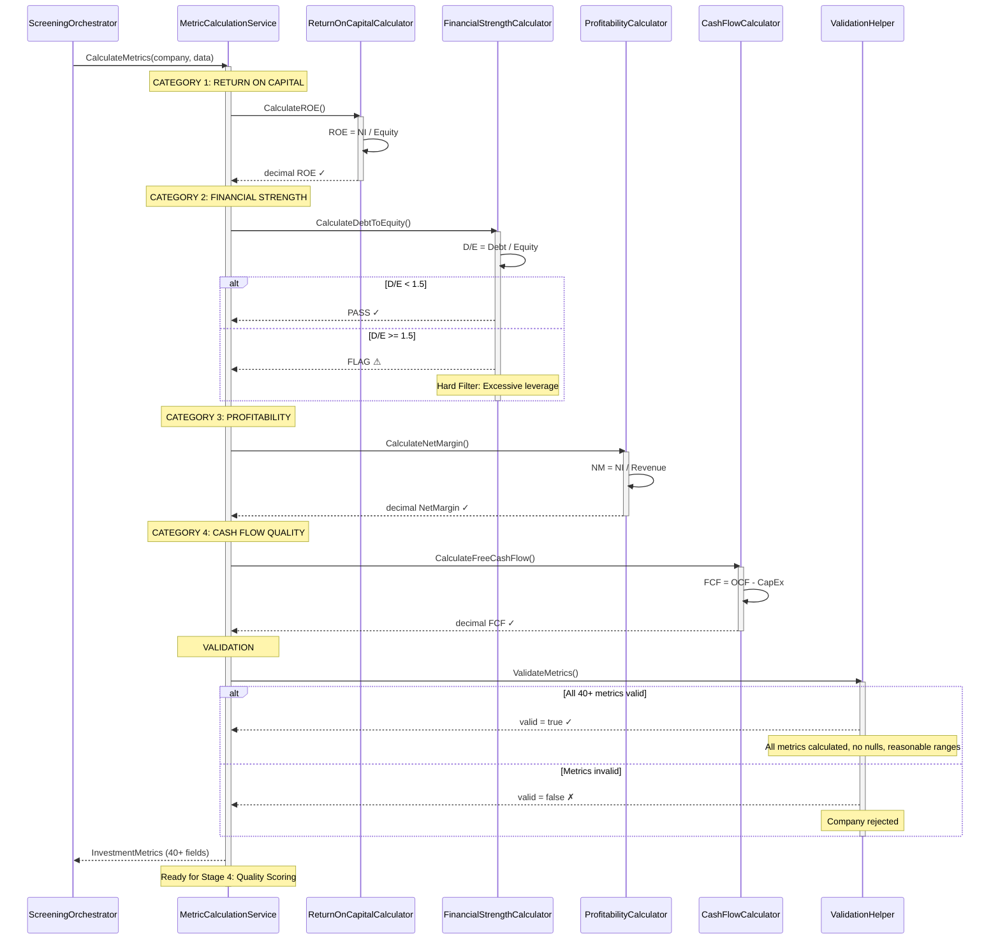
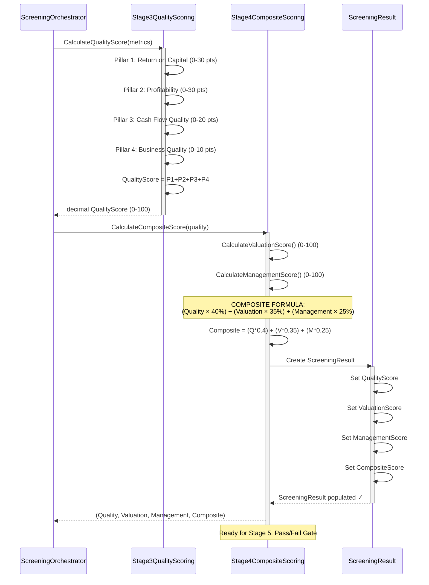
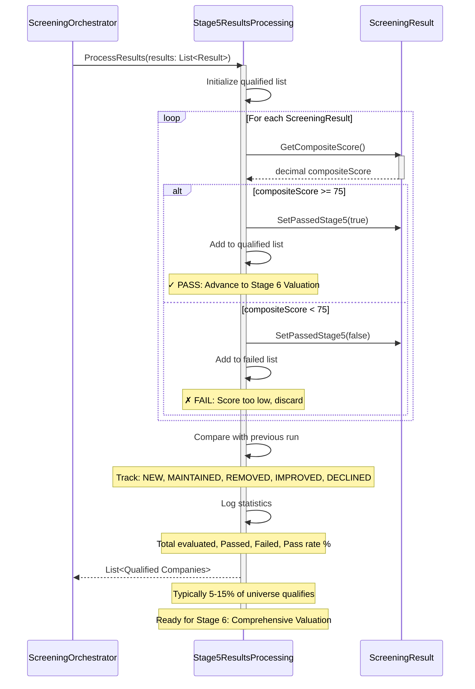
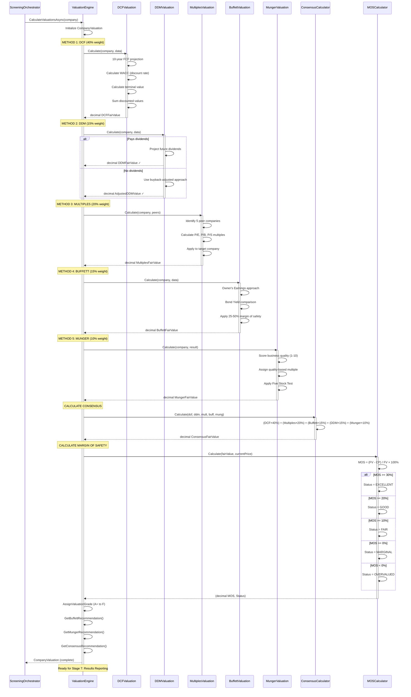
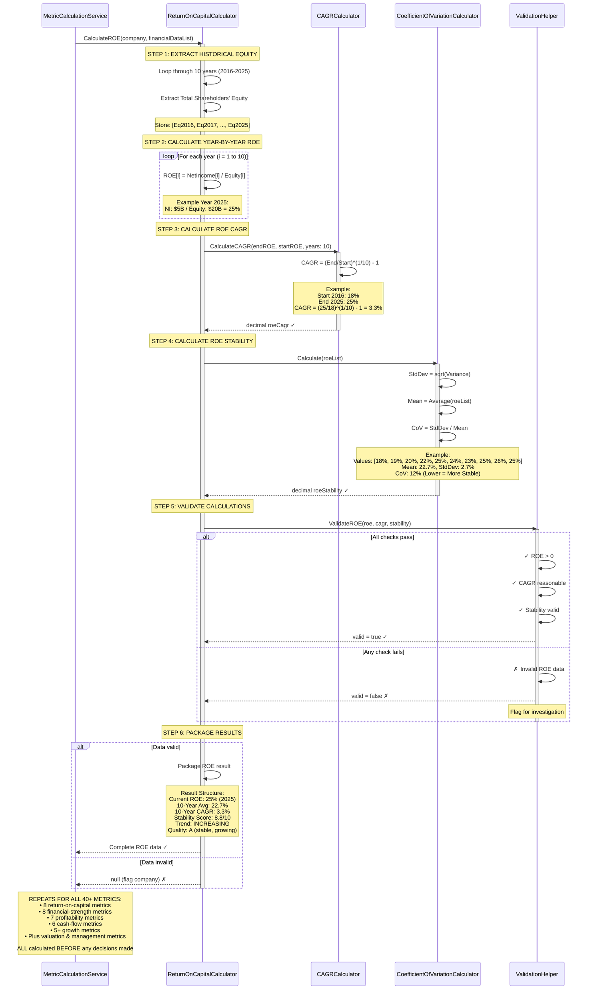

# Stock Market Screener - Comprehensive Sequence Diagrams

**Version:** 1.0  
**Date:** 2026-03-15  
**Author:** ThommCroft  
**Purpose:** Detailed sequence diagrams showing all major workflows

---

## Table of Contents

1. [Complete Quarterly Screening Flow](#complete-quarterly-screening-flow)
2. [Stage 0: Market Cap Pre-Filter](#stage-0-market-cap-pre-filter)
3. [Stage 1: Data Ingestion & Reconciliation](#stage-1-data-ingestion--reconciliation)
4. [Stages 2-3: Metric Calculation](#stages-2-3-metric-calculation)
5. [Stage 4: Composite Scoring](#stage-4-composite-scoring)
6. [Stage 5: Pass/Fail Gate](#stage-5-passfail-gate)
7. [Stage 6: Valuation Methods](#stage-6-valuation-methods)
8. [Stage 7: Results Reporting](#stage-7-results-reporting)

---

## Complete Quarterly Screening Flow



## 2. Stage 0: Market Cap Pre-Filter



## 3 . Stage 1: Data Ingestion & Reconciliation



## 4. Stages 2-3: Metric Calculation & Hard Filters



## 5. Stage 4: Composite Scoring



## 6. Stage 5: Pass/Fail Gate



## 7. Stage 6: Valuation Methods (Complete)



## 8. Stage 7: Results Reporting

```mermaid
sequenceDiagram
    participant ScreeningOrchestrator
    participant ReportingService
    participant ReportGroupingService
    participant EmailReportGenerator
    participant GitHubSummaryGenerator
    participant CSVExportGenerator
    participant IRepository
    database MySQL

    ScreeningOrchestrator->>ReportingService: GenerateAndSendAsync(valuations)
    activate ReportingService
    
    Note over ReportingService: STEP 1: GROUP BY OPPORTUNITY
    ReportingService->>ReportGroupingService: GroupByOpportunity(valuations)
    activate ReportGroupingService
    
    loop For each CompanyValuation
        alt Quality >= 80 AND MOS >= 30%
            ReportGroupingService->>ReportGroupingService: Group 1: SLAM DUNK BUYS
        else Quality >= 75 AND MOS >= 20%
            ReportGroupingService->>ReportGroupingService: Group 2: STRONG BUYS
        else Quality >= 82 AND MOS >= 10%
            ReportGroupingService->>ReportGroupingService: Group 3: FAIR VALUE
        else Quality >= 80 AND MOS < 0%
            ReportGroupingService->>ReportGroupingService: Group 4: OVERVALUED (Watchlist)
        end
    end
    
    ReportGroupingService-->>ReportingService: Dictionary<ReportGroup, List<Companies>>
    deactivate ReportGroupingService
    
    Note over ReportingService: STEP 2: GENERATE EMAIL REPORT
    ReportingService->>EmailReportGenerator: GenerateReport(grouped)
    activate EmailReportGenerator
    EmailReportGenerator->>EmailReportGenerator: Create header & executive summary
    EmailReportGenerator->>EmailReportGenerator: Create grouped sections
    EmailReportGenerator->>EmailReportGenerator: Format company details
    EmailReportGenerator->>EmailReportGenerator: Attach CSV
    EmailReportGenerator->>EmailReportGenerator: SendEmail()
    EmailReportGenerator-->>ReportingService: Email sent ✓
    deactivate EmailReportGenerator
    
    Note over ReportingService: STEP 3: GENERATE GITHUB SUMMARY
    ReportingService->>GitHubSummaryGenerator: GenerateMarkdown(grouped)
    activate GitHubSummaryGenerator
    GitHubSummaryGenerator->>GitHubSummaryGenerator: Create summary tables
    GitHubSummaryGenerator->>GitHubSummaryGenerator: Create top 5 opportunities
    GitHubSummaryGenerator->>GitHubSummaryGenerator: Create insights section
    GitHubSummaryGenerator->>GitHubSummaryGenerator: PostToGitHubActions()
    GitHubSummaryGenerator-->>ReportingService: Summary posted ✓
    deactivate GitHubSummaryGenerator
    
    Note over ReportingService: STEP 4: GENERATE CSV EXPORT
    ReportingService->>CSVExportGenerator: GenerateCSV(valuations)
    activate CSVExportGenerator
    CSVExportGenerator->>CSVExportGenerator: Create header (50+ columns)
    CSVExportGenerator->>CSVExportGenerator: Create data rows
    CSVExportGenerator->>CSVExportGenerator: WriteToFile()
    CSVExportGenerator->>CSVExportGenerator: ValidateOutput()
    CSVExportGenerator-->>ReportingService: CSV generated ✓
    deactivate CSVExportGenerator
    
    Note over ReportingService: STEP 5: STORE IN DATABASE
    ReportingService->>IRepository: SaveValuationsAsync(valuations)
    activate IRepository
    
    loop For each CompanyValuation
        IRepository->>MySQL: INSERT INTO CompanyValuations
        activate MySQL
        MySQL->>MySQL: Store complete valuation record
        MySQL-->>IRepository: Stored (ID returned)
        deactivate MySQL
    end
    
    IRepository-->>ReportingService: All records saved ✓
    deactivate IRepository
    
    ReportingService-->>ScreeningOrchestrator: Reporting complete
    Note over ReportingService: ✓ Email sent<br/>✓ GitHub summary posted<br/>✓ CSV generated<br/>✓ Database updated
    deactivate ReportingService
    
    ScreeningOrchestrator-->>ScreeningOrchestrator: QUARTERLY SCREENING COMPLETE!
    Note over ScreeningOrchestrator: Results Delivered:<br/>1. Email report (detailed)<br/>2. GitHub summary (quick view)<br/>3. CSV export (spreadsheet)<br/>4. Database storage (historical)
```

## 9. Utility: Individual Metric Calculation (ROE Example)



---
