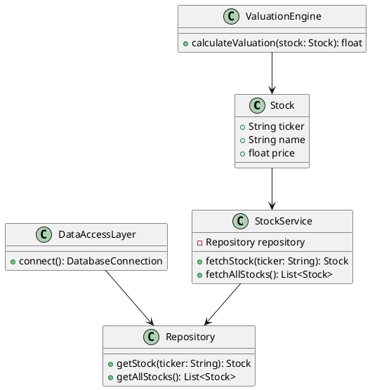
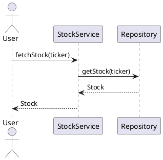

# UML Class Diagrams for Stock Market Screener

## Overview
This document provides comprehensive UML diagrams illustrating all classes, interfaces, and relationships within the Stock Market Screener project. It covers key components such as core models, services, repositories, valuation engine, and data access layers.

## Class Diagram

### Explanation:
- **Stock**: Represents a financial instrument with attributes like ticker symbol, name, and price.
- **Repository**: Interface to manage Stock objects, allowing fetching of individual or all stocks.
- **ValuationEngine**: Responsible for calculating the valuation of a stock.
- **StockService**: Acts as a service layer that interacts with the repository to fetch stock data and perform operations.
- **DataAccessLayer**: Manages the connection to the database and acts as the intermediary between the StockService and data persistence layer.

## Additional Diagrams
### Sequence Diagram

## Conclusion
The UML diagrams provided in this document serve as a guide to understanding the architecture and interactions within the Stock Market Screener application. They illustrate the relationships between various components, aiding in both development and future enhancements.