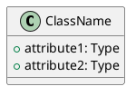
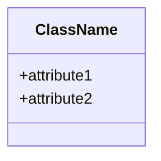

# UML Class Diagrams

## PlantUML Format

```plantuml
@startuml
class ClassName {
    +attribute1: Type
    +attribute2: Type
}
@enduml
```

## Mermaid Format

```mermaid
classDiagram
    ClassName : +attribute1
    ClassName : +attribute2
```
